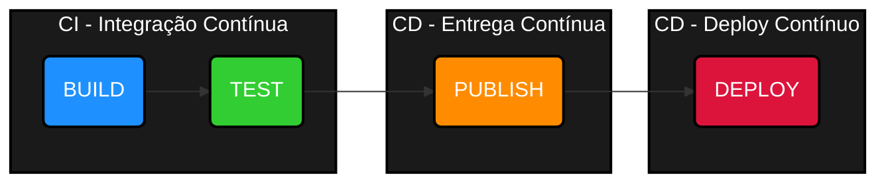

# A cultura DevOps
Vamos começar entendendo o que é [Devops](https://aws.amazon.com/pt/devops/what-is-devops/).<p>
 Entenda como uma cultura pela qual as empresas utilizam práticas e ferramentas que ajudam a aumentar o desenvolvimento e entrega de software. 

Assim, desenvolvedores de softwares e operadores de infra estrutura trabalham em conjunto, ```compartilhando conhecimento```, colaborando e participando de todo o processo desde o início até o fim.
<br>

<h1 align="center" style="border-bottom: none">
    <br>
</h1>

Devops, é a junção das siglas **DEV**(desenvolvimento) e **OPS**(operação). 

⚠️ **Devops não é automação.**

---
## &#x1F44D; Benefícios ao se adotar a cultura Devops
- 🚀 **Velocidade de entrega**
    - Usa ferramentas para automatizar processos lentos e manuais.
- 🃏 **Escalabilidade**
    - A infraestrutura passa a ser gerenciada através de código(infrascode).
- 🧑‍🤝‍🧑 **Colaboração**
    - As duas equipes trabalham juntas para atingir o mesmo propósito.
- 👍 **Confiabilidade**
    - Automatização de testes de vários níveis durante todo o processo de desenvolvimento.
- 🔐 **Segurança**
    - Gerenciamento de configuração, políticas de segurança automática e controle de acessos.

## &#x1F4D6; Melhores práticas
Para garantir um nível de qualidade e evitar possíveis problemas durante o processo de construção de uma aplicação até o seu uso, é muito importante que o Engenheiro Devops, use as melhores práticas do mercado. 

A seguir, vamos entender quais são elas.

&#x1F4C3; **Infraestrutura como código**  
A infraestrutura é criada de forma programática e não mais de forma manual.
|✅ __Vantagens__|🛑 __Desvantagens__|
|:---|:---|
| - A equipe poderá compartilhar e reaproveitar o código;<br> - A infraestrutura passa a ser controlada através de um controlador de versão;<br> - Os ambientes podem sofrer alterações de forma simultânea ou individual. | - Curva de aprendizado;<br>- Risco de erros em larga escala;<br>- Segurança e versionamento mal gerenciados.|

⚙️ **Arquitetura de microsserviços**  
Conjunto de pequenos serviços que juntos, representam um sistema.
|✅ __Vantagens__|🛑 __Desvantagens:__|
|:---|:---|
|- Cada serviço possui um única funcionalidade;<br> - Pode usar diferentes linguagens de programação;<br> - A implantação pode ocorrer de forma independentes dos demais.|- Complexidade operacional aumentada;<br>- Testes e debugging mais difíceis;<br>- Dependência de comunicação entre serviços.|

📤 **CI - Integração Contínua**  
Os testes são realizados sempre que o código é enviado para o repositório git central.
|✅ __Vantagens__|🛑 __Desvantagens:__|
|:---|:---|
|- Encontrar erros rapidamente a cada alteração do código;<br>- O tempo necessário de validação é reduzido;<br> - Ocorre de forma automática.|- Alto custo de configuração inicial;<br>- Qualidade dos testes impacta o processo;<br>- Feedback constante pode sobrecarregar o time.|

📦 **CD - Entrega Contínua**  
Após a execução dos devidos testes, o software poderá ser "empacotado" e armazenado/implementado.
|✅ __Vantagens__|🛑 __Desvantagens:__|
|:---|:---|
|- Todo o processo de testes, empacotamento e entrega, são automatizados;<br>- Histórico e rastreamento através da ferramenta utilizada;<br>- Poderá ser adicionado a necessidade de autorização por um membro da equipe.|- Risco de liberar código instável;<br>- Dependência de automação bem construída;<br>- Integração com processos organizacionais.|

🚀 **CD - Deploy Contínuo**  
É a prática de liberar automaticamente em produção toda alteração de código que passa com sucesso por todos os testes automatizados e validações da pipeline CI/CD — sem intervenção humana.

|✅ __Vantagens__|🛑 __Desvantagens:__|
|:---|:---|
|- Liberação mais rápida e frequente de valor para o cliente;<br>- Feedback quase em tempo real;<br>- Redução de riscos com mudanças menores e contínuas.|- Exige testes automatizados impecáveis;<br>- Monitoramento e alertas robustos;<br>- Cultura de engenharia muito madura.|

&#x1F4C9; **Monitoração**  
Observar o comportamento do ambiente e da aplicação.
|✅ __Vantagens__|🛑 __Desvantagens:__|
|:---|:---|
|- Observabilidade;<br>- Rastreamento;<br>- Gerar automações com base no comportamento da coleta de logs.|- Sobrecarga de dados e ruído;<br>- Curva de aprendizado das ferramentas;<br> - Custos crescentes.|
 
&#x1F4E2; **Comunicação e colaboração**  
As equipes passam a trabalharem juntas com o objetivo de um bem comum.
|✅ __Vantagens__|🛑 __Desvantagens:__|
|:---|:---|
|- Definir normas culturais;<br>- Compartilhamento de experiências;<br>- Melhoramento contínuo no processo de trabalho.<br>|- Choque de culturas entre times;<br>- Sobrecarga de reuniões e alinhamentos;<br> - Falta de clareza e ruído na comunicação |

---
## &#x1F503; Estágios Devops
A tabela abaixo, lhe ajudará a entender de forma simples, os estágios de um processo Devops.

<table border="1" style="width:100%; border-collapse: collapse;">

<tr>
    <td><h1 align="center" style="border-bottom: none"><br><h6><center>Planejar(plan)</center></h6>
    <td>Definir o que precisa ser feito;<br>Como será feito;<br>Organizar as atividades.</td>
    <td><h1 align="center" style="border-bottom: none"><br><h6><center>Desenvolver(code)</center></h6>
    <td>Criar os códigos;<br>Controlar as versões;<br>Documentar as atividades.</td>
    <td><h1 align="center" style="border-bottom: none"><br><h6><center>Construir(build)</center></h6></td>
    <td>Gerar as primeiras versões;<br>Realizar testes primários;<br>Resolver bugs do código.</td>
</tr>

<tr>
    <td><h1 align="center" style="border-bottom: none"><br><h6><center>Testar(test)</center></h6></td>
    <td>Funcionalidades do sistema;<br>Integrações;<br>Teste de infraestrutura.</td>
    <td><h1 align="center" style="border-bottom: none"><br><h6><center>Entregar(release)</center></h6></td>
    <td>Lançamento do software ou funcionalidade;<br>Escalar e realizar manutenções;<br>Alterações da infraestrutura.</td>
    <td><h1 align="center" style="border-bottom: none"><br><h6><center>Implantar(deploy)</center></h6></td>
    <td>Instalação do sistema;<br>Pode ser encapsulado a um contêiner;<br>A implantação ocorre de forma automática.</td>
</tr>

<tr>
    <td><h1 align="center" style="border-bottom: none"><br><h6><center>Operar(operate)</center></h6></td>
    <td>Modificar um determinado comportamento;<br>Escalar e realizar manutenções;<br>Alterações na infraestrutura.</td>
    <td><h1 align="center" style="border-bottom: none"><br><h6><center>Monitorar(monitor)</td>
    <td>Observar o comportamento da aplicação;<br>Criar dashboards;<br>Criar insumos para o time de dev e infra.</td>
</tr>

</table>

Para cada estágio, existem diversas ferramentas disponíveis para ajudar no processo como um todo.


---

## &#x1F9F0; Ferramentas utilizadas
Atualmente(2023), as ferramentas descritas abaixo, são as mais utilizadas pelas empresas que seguem a cultura Devops.

|ESTÁGIO|FERRAMENTAS|DESCRIÇÃO|
|:---:|:---:|:---|
PLAN (planejamento)| <a href="https://miro.com/pt/"></a> <a href="https://excalidraw.com/"></a> | **Miro** - Plataforma visual colaborativa em formato de lousa online.<br>**Excalidraw** - Ferramenta online gratuita de desenho colaborativo.
CODE (desenvolvimento)| <a href="https://git-scm.com/"></a> <a href="https://www.atlassian.com/software/confluence"></a> <a href="https://www.atlassian.com/software/jira"></a>| **GIT** - Controle de versionamento de código. _Confluence_ - Documentação. **Jira** - Controle das atividades.
BUILD (construção)|<a href="https://www.maven.apache.org"></a>  <a href="https://www.npmjs.com/"></a>  | **Maven** - Utilizado para realizar o build de código Java. **_NPM_** - Utilizado para realizar o build de código NodeJS. 
Test (Testes)| <a href="https://junit.org/junit5/"></a><a href="https://www.selenium.dev/"></a><a href="https://www.selenium.dev/">| **JUnit** - Ferramenta utilizada para a realizaçao de testes unitários. <br>**Selenium** - Ferramenta utilizada para a realização de telas/fluxos.<br>**Jmeter** - testes de desempenho, carga e stress em aplicações.
RELEASE (entrega)|<a href="https://www.jenkins.io"></a> <a href="https://www.gitlab.com"></a>| Ambas as ferramentas, são utilizadas para a criação de pipelines CI/CD. 
DEPLOY (implantação)| <a href="https://aws.amazon.com/pt/"></a> <a href="https://cloud.google.com/"></a><a href="https://cloud.google.com/"></a><a href="https://www.docker.com/"></a> | **AWS, GCP, Azure** - Provedores Cloud, que oferecem diversos recursos computacionais para a implantação de sistemas. <br>**Docker** - Ferramenta que facilita a criação e administração de ambientes isolados. Ele possibilita o empacotamento de uma aplicação dentro de um contêiner, se tornando portátil para qualquer outro host que contenha o Docker instalado.
OPERATE (operação)| <a href="https://kubernetes.io/"></a>| **Kubernetes** - Ferramenta de orquestração de contêineres.
MONITOR (monitoração)| <a href="https://www.zabbix.com/"></a> <a href="https://prometheus.io/"></a> <a href="https://www.splunk.com/"></a><a href="https://www.grafana.com"></a> | **Zabbix** - Monitoração da infraestrutura como: CPU, Memória, Disco, etc. <br>**Prometheus** - Monitoração da aplicação como: métricas e alertas. <br>**Splunk** - Realiza a observabilidade do ambiente.<br> **Grafana** - Conecta nas demais ferramentas de monitoração, apresentando diversos dashboards pré-configurados.

---

## &#x1F6AB; &#x1F4B0; Segurança e Custos
Ao se utilizar da cultura devops para o desenvolvimento e implantação de software duas coisas importantes precisam ser levantadas, sendo elas:

- **Segurança:**
    - Segurança distribuída dentro da organização;
    - Prevenção e vulnerabilidades;
    - Softwares mais seguros e com qualidade;
    - Redução de custos para identificar e resolver problemas de segurança.

- **Custos:**
    - Licenças de softwares;
    - Recursos computacionais utilizados;
    - Outros

##  Pipeline CI/CD
A pipeline CI/CD (Integração Contínua e Entrega/Implantação Contínua) é uma automação estruturada que guia o código desde o desenvolvimento até a produção. Ela permite que mudanças em software sejam testadas, validadas, empacotadas e implantadas de forma automática e contínua, com o mínimo de intervenção humana.



Quanto as siglas, temos:

- **CI - Continuos Integration**

    * Desenvolvedores enviam código (commit/push) com frequência*;  
    * O código é automaticamente construído (build) e testado (test) para validar a integridade da aplicação.

- **CD - Continuos Delivery**

    * O código aprovado é empacotado e publicado (publish) em ambientes de homologação ou staging*.

- **CD - Continuos Deployment**

    * Após validações finais, a aplicação é implantada automaticamente em produção, de forma confiável e segura.  

**Benefícios**:  

* Redução de erros humanos;  

* Agilidade no tempo que uma ideia leva para se transformar em um produto funcional 
    disponível no mercado(time-to-market);  
    
* Maior confiabilidade e rastreabilidade nas entregas.

## 🎱 Metodologia

**SCRUM** 

[Scrum](https://www.scrum.org/) é um framework que ajuda pessoas, times e organizações a gerar valor por meio de soluções adaptativas para problemas complexos.

 Scrum envolve grupos de pessoas que, coletivamente, possuem todas as
habilidades e conhecimentos necessários para fazer o trabalho e compartilhar ou adquirir essas
habilidades conforme necessário.


#### **Scrum TEAM**
Os membros possuem todas as
habilidades necessárias para criar valor a cada Sprint. Eles também são autogerenciáveis, o
que significa que decidem internamente quem faz o quê, quando e como. 

- **_Scrum Master:_** 

  Treinar os membros do time em autogerenciamento e cross-funcionalidade; 
  
  Concentrar na criação de incrementos de alto valor.

- **_Product Owner:_**

  Gerenciar o Product Backlog;

  Ordenar os itens do Backlog;

  Pode cancelar uma Sprint.

- **_Developers:_** 

  Cria plano para a Sprint Backlog;

  Definiçao de pronto;

  Colocar meta na Sprint.

#### **Sprint** 
Sprints são o coração do Scrum, onde ideias são transformadas em valor.
São eventos de duração fixa de um mês ou menos para criar consistência. Uma nova Sprint começa imediatamente após a conclusão da Sprint anterior.

 - **Planning**
   - Define o trabalho a ser realizado com base no backlog;
   - Reunião com duração máxima de 8 horas para sprint de um mês.
 - **Daily**
   - Duraçao de 15 minutos;
   - Falar o que foi feito ontem, o que será feito hoje e se tem algum impedimento.
 - **Review**
   - Inspecionar o resultado da Sprint;
   - Reunião com duração máxima de 4 horas para sprint de um mês.
 - **Retrospective**
   - Planejar maneiras de aumentar a qualidade e eficácia.
   - Reunião com duração máxima de 3 horas para sprint de um mês.

**KANBAN**

[Kanban](https://pt.wikipedia.org/wiki/Kanban), consiste em uma ferramenta voltada a gestão de tarefas. Possui colunas que organizam as atividades de uma pessoa ou equipe. Enquadra-se no grupo das “metodologias ágeis”, que têm como principal objetivo a melhora da produtividade.

|TO DO (backlog)|DOING|TEST|DONE|
|:---           |:--- |:---|:---
|Atividade 1|Atividade 1||
|Atividade 2||Atividade 2|
|Atividade 3|||Atividade 3

## 📝  Descrição das atividades
É muito importante que você use uma linguagem simples e objetiva na descrição das atividades em que você estará atuando.

**Ao criar a task da atividade**

>Eu como engenheiro devops, preciso criar uma imagem docker Maven. 
Os arquivos desse projeto, serão armazenados nesse repositório git: http://repo_git.dominio.com.br
Vou seguir essa documentação de referência: http://documentacao.com.br_


**Ao editar a task da atividade**

>Criei a primeira versão do projeto que está na branch de dev.
Ainda falta configurar a integração com a ferramenta Sonar.
Preciso discutir algumas coisas com o @fabio e @maria


## ❓ Siglas
A tabela abaixo, lhe ajudará a entender o significado das siglas utilizadas na cultura Devops.

| **SIGLA**  | **SIGNIFICADO**                                       |**DESCRIÇÃO**                                                                        |
|---         |---                                                    |---                                                                                  |
| **CI**      | *Continuous Integration*                             | Integração frequente de código em um repositório central, com testes automatizados. |
| **CD**      | *Continuous Delivery / Continuous Deployment*        | Entrega ou implantação contínua de software com segurança e agilidade.              |
| **IaC**     | *Infrastructure as Code*                             | Gerenciamento de infraestrutura por meio de arquivos de código (ex: Terraform).     |
| **CICD**    | *Continuous Integration and Continuous Delivery*     | Conjunto de práticas automatizadas do DevOps.                                       |
| **API**     | *Application Programming Interface*                  | Interface de comunicação entre aplicações, usada para integrações.                  |
| **VCS**     | *Version Control System*                             | Sistema de controle de versões (ex: Git) que rastreia mudanças no código.           |
| **SRE**     | *Site Reliability Engineering*                       | Engenharia focada na confiabilidade e operação de sistemas em larga escala.         |
| **CDN**     | *Content Delivery Network*                           | Rede de servidores que distribui conteúdo para reduzir latência.                    |
| **K8s**     | *Kubernetes*                                         | Orquestrador de contêineres para escalar e gerenciar aplicações em produção.        |
| **DNS**     | *Domain Name System*                                 | Sistema que traduz nomes de domínio em endereços IP.                                |
| **SSL/TLS** | *Secure Sockets Layer / Transport Layer Security*    | Protocolos de segurança para comunicação criptografada.                             |
| **ELK**     | *Elasticsearch, Logstash, Kibana*                    | Stack de monitoramento e análise de logs.                                           |
| **ACM**     | *AWS Certificate Manager*                            | Gerenciamento de certificados SSL/TLS na AWS.                                       |
| **S3**      | *Simple Storage Service*                             | Serviço de armazenamento de objetos da AWS.                                         |
| **RDS**     | *Relational Database Service*                        | Banco de dados relacional gerenciado na nuvem (AWS).                                |
| **EC2**     | *Elastic Compute Cloud*                              | Servidores virtuais escaláveis da AWS.                                              |
| **VPC**     | *Virtual Private Cloud*                              | Rede isolada na nuvem.                                                              |
| **CIAM**    | *Customer Identity and Access Management*            | Gerenciamento de identidade e acesso de usuários.                                   |
| **DevSecOps** | *Development, Security, and Operations*            | Integra a segurança no processo DevOps desde o início do desenvolvimento.           |
| **FinOps**  | *Financial Operations*                               | Prática que une engenharia, finanças e negócios para otimizar custos na nuvem.      |
| **IOPS**    | *Input/Output Operations Per Second*                 | Medida de desempenho de discos e sistemas de armazenamento.                         |
| **SCM**     | *Source Code Management*                             | Gerenciamento de código-fonte, incluindo controle de versão e colaboração.          |

--- 

# 👷🏻 Competências Técnicas
O [Engenheiro Devops](https://www.coursera.org/articles/devops-engineer), é um pofissional de tecnologia no qual tem a função de ajudar desenvolvedores e analistas de infraestrutura, a gerenciar, automatizar e integrar ferramentas computacionais.  

Pode ser entendido como um arquiteto de automações e integrações, garantindo que o ciclo de vida do software seja rápido, seguro e confiável.  

Isso torna-se possível, através do conhecimento necessário de diversas ferramentas tecnológicas no qual são seguimentadas conforme abaixo:  

- ☁️ Computação em Nuvem;
- 💻 Sistema Operacional;
- 🏗️ Infraestrutura como código;
- 🧰 Build;
- 🐳 Conteinerização da aplicação;
- 📊 Monitoração da aplicação e infraestrutura;
- 🤖 Automação de processos e rotinas;
- 🙋🏻‍♀️ Colaboração e Documentação Técnica.

## Soft Skill

- Ter boa comunicação;
- Ser organizado;
- Ter auto gerenciamento;
- Ser Resiliente e curioso;
- Não ter preguiça de aprender.

## Hard Skill

- Saber operar um Sistema Operacional;
- Criar img e gerenciar contêineres;
- Criar pipelines de CI/CD;
- Automatizar rotinas;
- Entender a leitura de algumas linguagens de programação;
- Conhecer um pouco de redes e segurança.

## 📑 Arquivos mais utilizados
O Engenheiro Devops, precisará entender a sintaxe de alguns arquivos, que são utilizados em determinados processos de automação.

<table border="0" style="width:100%; border-collapse: collapse;">
<tr>
    <td><h1 align="center" style="border-bottom: none">
    <td><h1 align="center" style="border-bottom: none">
    <td><h1 align="center" style="border-bottom: none">   
    <td><h1 align="center" style="border-bottom: none">
    <td><h1 align="center" style="border-bottom: none">
    <td><h1 align="center" style="border-bottom: none">
    <td><h1 align="center" style="border-bottom: none">  
</tr>

<tr>
<td>Extensão .json;<br>chave:valor; <br>Utilizado para transmitir dados em aplicações web.</td>
<td>Extensão .sh;<br>Comandos Linux; <br>Utilizado para automatizar rotinas.</td>
<td>Extensão .tf;<br>Formato mapa ou lista; <br>Utilizado para criar recursos computacionais nos provedores Cloud.</td>
<td>Extensão .py;<br>Sequência de instruções; <br>Utilizado para automatizar rotinas ou desenvolver programas.</td>
<td>Extensão .yaml;<br>chave:valor; <br>Utilizado por algumas ferramentas Devops.</td>
<td>Extensão .md;<br>Arquivo de texto; <br>Utilizado para criar documentações técnicas.</td>
<td>Extensão .xml;<br>Tags; <br>Utilizado para para transportar e armazenar dados.</td>
</tr>
</table>

**Arquivo [JSON](https://www.alura.com.br/artigos/o-que-e-json)**  
JavaScript Object Notation
```json
{
   "cliente": {
       "id": 2020,
       "nome": "Maria Aparecida"
   },
   "pagamentos": [
       {
           "id": 123,
           "descricacao": "Compra do livro Cangaceiro JavaScript",
           "valor": 50.5
       },
       {
           "id": 124,
           "descricacao": "Mensalidade escolar",
           "valor": 1500
       }
   ]
}
```

**Arquivo [Bash](https://www.gnu.org/software/bash/manual/bash.html)**  
Born Again Shell
```sh
#/bin/bash

# Comentário...

DATA: $(date)
echo $DATA
exit 0
```

**Arquivo [Python](https://www.python.org/)**

```py
ano = 2022
print (f'Olá {ano}')
```

**Arquivo [HCL](https://developer.hashicorp.com/terraform/language/syntax/configuration)**  
Hashicorp Configuration Language
```c
resource "aws_instance" "ec2_instance"
ami           = xpto
instance_type = x1
subnet_id     = var.subnet_id
```

**Arquivo [YAML](https://www.redhat.com/pt-br/topics/automation/what-is-yaml)**  
Yet Another Markup Language
```yaml
image: docker:latest

variables:
  foo: bar

before_script
  - echo "Mensagem..."

script:
  - Docker login
  - Docker pull nginx:latest
  - Docker run -dit ... 
```

**Arquivo [Markdown](https://www.markdownguide.org/)**  
Markdown
```md
# Título

Tabela:
|CAMPO 1|DESCRICAO|
|:--  |:--
|Valor| Descrição


```

**[Documentação XML](https://www.xml.com/)**  
eXtensible Markup Language
```xml
<?xml version="1.0"?>
<PurchaseOrders xmlns="www.contoso.com">
  <PurchaseOrder
      PurchaseOrderNumber="99503"
      OrderDate="1999-10-20">
    <Address Type="Shipping">
      <Name>Ellen Adams</Name>
      <Street>123 Maple Street</Street>
      <City>Mill Valley</City>
      <State>CA</State>
      <Zip>10999</Zip>
      <Country>USA</Country>
    </Address>
 </PurchaseOrder>
</PurchaseOrders>
```

## Entender os códigos do protocolo [HTTP]
É muito importante que você saiba entender o significado de alguns [códigos de retorno](https://www.restapitutorial.com/httpstatuscodes.html), do protocolo [HTTP](https://developer.mozilla.org/pt-BR/docs/Web/HTTP/Basics_of_HTTP). Isso te ajudará muito durante um determinado processo de troubleshooting.

**Tabela de códigos HTTP**

|CÓDIGO|DESCRIÇÃO|
|:---:|:---      |
|200  | A requisição foi executada com sucesso |
|400  | A requisição não pôde ser compreendida pelo servidor|
|401  | Não autorizado. O servidor requer autenticação do cliente
|403  | A requisição foi compreendida pelo servidor, porém o mesmo se recusa a atender |
|404  | A requisição foi compreendida pelo servidor, porém o mesmo não encontrou o que foi solicitado 
|500  | O servidor encontrou uma condição inesperada que o impediu de atender à solicitação. 
|502  | O servidor recebeu uma resposta inválida do proxy ou gateway 
|503  | O servidor está sobrecarregado ou sofrendo alguma manutenção
|504  | O tempo de resposta na comunicação do servidor com outros serviços, foi excedido

## API - Application Programming Interface
Uma [API](https://www.freecodecamp.org/news/what-does-api-stand-for-a-definition-of-the-coding-acronym-in-plain-english/) é um conjunto de regras e padrões que permite que diferentes sistemas, aplicações ou serviços se comuniquem entre si de forma estruturada e segura.
Ela funciona como uma ponte que conecta softwares, permitindo que um sistema use funcionalidades de outro sem precisar saber como ele funciona internamente.

✅ Vantagens

 - **Integração fácil entre sistemas**: conecta aplicações diferentes (ex: frontend com backend).

 - **Reutilização de funcionalidades**: evita “reinventar a roda” ao reaproveitar serviços existentes (como pagamentos, geolocalização, etc).

 - **Escalabilidade**: facilita o crescimento modular da aplicação, com novos serviços se conectando via API.

 - **Automatização**: possibilita automações (ex: enviar e-mails, criar tickets, consultar dados) sem interação manual.

 - **Segurança controlada**: com autenticação (ex: tokens, OAuth), acessos podem ser restritos e monitorados.

❌ Desvantagens

 - **Dependência externa**: se a API de terceiros estiver fora do ar, sua aplicação pode ser impactada.

 - **Gerenciamento de versão**: mudanças na API exigem cuidado para manter a compatibilidade com quem a utiliza.

 - **Segurança**: se mal implementada, pode expor dados sensíveis ou abrir brechas para ataques.

|CASO DE USO|API ENVOLVIDA
|:--        |:--
|Login via Google/Facebook | OAuth API (Google, Meta)
|Pagamentos online | Stripe API, PayPal API, Pix API
|Previsão do tempo em apps | OpenWeather API, WeatherStack API
|Geolocalização no celular | Google Maps API, Mapbox API
|Busca de produtos em marketplace | Mercado Livre API, Amazon API

### Exemplos práticos

Buscar um usuário:
```bash
curl -X GET https://api.exemplo.com/users/123

```

Criar um novo usuário:
```bash
curl -X POST https://api.exemplo.com/users \
  -H "Content-Type: application/json" \
  -d '{"name": "João Silva", "email": "joao@example.com"}'

```

Substituir um usuário existente:
```bash
curl -X PUT https://api.exemplo.com/users/123 \
  -H "Content-Type: application/json" \
  -d '{"name": "João da Silva", "email": "joao.novo@example.com"}'

```

Atualizar um campo:
```bash
curl -X PATCH https://api.exemplo.com/users/123 \
  -H "Content-Type: application/json" \
  -d '{"email": "joao.atualizado@example.com"}'

```

Remover um usuário: 
```bash
curl -X DELETE https://api.exemplo.com/users/123

```

---
